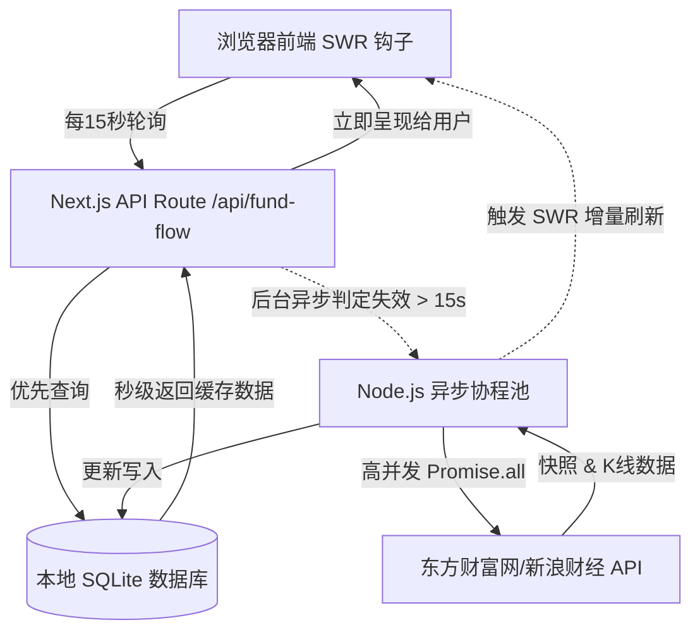

# StockView Pro - 实时板块资金流向看板项目文档

本项目是为大王深度定制的高性能、极速响应的 A 股板块资金流向实时追踪系统。旨在解决旧版 Streamlit 架构下页面白屏等待时间长、刷新阻塞、高频刷新性能差以及多折线交互混乱的问题。

---

## 1. 核心架构与设计模式

项目采用 **Next.js (App Router) + SQLite 本地缓存 + SWR 状态流 + ECharts 高性能图表** 的现代化前沿技术栈构建。

### 📊 数据流图解


---

## 2. 核心特性功能

### ⚡ 1. Stale-While-Revalidate (SWR) 与 SQLite 混合缓存 (秒开体验)
* **秒开显示**：首次打开或刷新页面时，服务端直接从本地 SQLite 数据库中读取上一秒保存的历史 K 线和快照数据，响应时间 **< 10ms**，彻底告别原 Streamlit 页面白屏等待半分钟的糟糕体验。
* **无感后台更新**：在向用户展示旧数据的同时，服务端默默在后台拉取最新分时数据并更新数据库，更新完成后前端自动渲染新数据，整个过程毫无阻塞感。

### 🔄 2. 双通道数据容灾 (Sina & Eastmoney Fallback)
* **防封锁通道**：由于东方财富接口对高频连接极易返回 `ECONNRESET`（挂断连接）或 `429`，系统内置了新浪财经（Sina）接口的自动降级通道。
* **自动正序排列**：针对新浪 API 倒序返回数据的缺陷，后端在清洗层增加了 `results.sort(...)` 算法，确保图表始终以从开盘（左）到收盘（右）的正确正序时间轴渲染。

### 🎯 3. 智能磁吸提示框 (Smart Tooltip Magnet) 与折线聚焦 (Emphasis Focus)
* **智能磁吸**：前端放弃了传统的 ECharts `item` 点 hover 模式（需要用鼠标去精确瞄准小圆点），改用了基于 **DOM 鼠标物理轨迹 + convertToPixel 空间变换** 的磁吸算法。鼠标滑入图表任意空白位置，即可自动吸附到距离指针垂直距离最近的那条折线上，并瞬间展示该板块的资金数据。
* **单线高亮聚焦**：当鼠标悬停在某条线上时，ECharts 会自动将其余 11 条线虚化（降低透明度），并加粗当前选中的折线，帮助大王快速看清走势脉络。

### 🎨 4. 符合 A 股视觉直觉的 UI 润色
* **红涨绿跌**：提示框（Hint）中，主力净流入金额大于 0 时渲染为 A 股经典的**亮红色**，小于 0（流出）时渲染为**亮绿色**。
* **板块颜色映射**：提示框顶部的板块名称颜色直接继承它在 ECharts 中的随机折线色，帮助大王快速将文字与线条在视觉上关联。
* **高度与清爽化**：
  * 走势图高度从 `500px` 拓宽到 **`650px`**，折线分布更舒展。
  * 板块排行榜明细表**默认收纳折叠**，不占用首屏高度，需要时可一键展开。
  * 明细表中的“涨跌幅”与“主力占比”强制归一化为**两位小数**。

---

## 3. 技术要点与部署运维

### 📂 目录结构
* `/src/lib/db.ts`：SQLite 数据库连接器，包含表结构定义。
* `/src/lib/eastmoney.ts`：Eastmoney & Sina 数据源拉取、降级、以及清洗排序算法。
* `/src/app/api/fund-flow/route.ts`：API 路由，处理缓存读取、过期判定与异步并发更新。
* `/src/app/page.tsx`：前端 React Client Component 交互及 ECharts 渲染配置。
* `/src/app/page.module.css`：纯 Vanilla CSS 编写的暗黑科技风玻璃拟物（Glassmorphism）样式。

### ⚙️ 开发模式启动
在 `/Users/weiwang/Projects/stockview-next` 目录下执行：
```bash
npm run dev
```
程序默认运行在：[http://localhost:3000](http://localhost:3000)

### 🧹 缓存重置与清理
若因为休市、异常历史值需要清理缓存，只需直接删除项目根目录下的 SQLite 缓存文件即可：
```bash
rm fund_flow_cache.db
```
系统在下次请求时会自动重新创建并初始化该文件。
