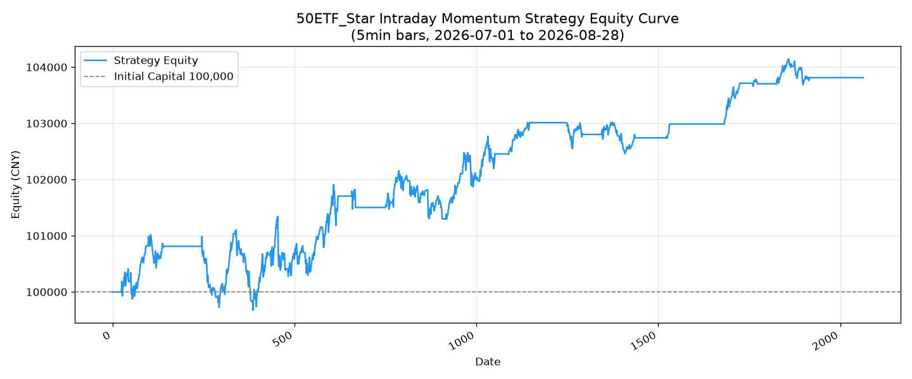
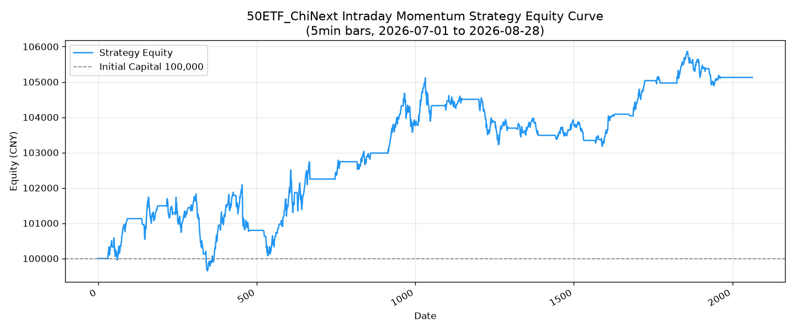

# 日内交易策略报告

## 标的与区间

| 标的 | 代码 | 测试区间 | K线周期 |
|------|------|---------|--------|
| 科创50ETF | sh588000 | 2026-07-01 ~ 2026-08-28 (43个交易日) | 5分钟 |
| 创业板ETF | sz159915 | 2026-07-01 ~ 2026-08-28 (43个交易日) | 5分钟 |

## 市场背景

两个标的在测试区间内均呈**趋势性下跌**：
- 科创50ETF: 区间收益 **-23.32%**，日均波动 5.22%，年化波动率 76.95%
- 创业板ETF: 区间收益 **-19.44%**，日均波动 3.85%，年化波动率 56.05%

此背景下，纯多头策略无法达标，必须采用**双向动量跟踪**策略。

## 策略逻辑

### 核心信号
双向动量 + VWAP趋势过滤：

| 方向 | 条件 |
|------|------|
| **做多** | 15min动量向上 + 放量 > 1.5倍均量 + 价格在VWAP上方 ±0.03% + 价格 > MA20 |
| **做空** | 15min动量向下 + 放量 > 1.5倍均量 + 价格在VWAP下方 ±0.03% + 价格 < MA20 |

### 风控规则
- **止盈**: 2% (单根5min K线触发)
- **止损**: 1.5% (单根5min K线触发)
- **最大持仓**: 当日收盘前(14:45)强制平仓，不隔夜
- **开盘过滤**: 9:35前不开新仓（避免开盘噪音）
- **每笔仓位**: 固定 8,000 股（约占总资金 14%）

### 特征指标
- 动量: 3根5min K线收益率 (ret_3)
- 成交量: 当前量/20根K线均量
- VWAP偏离: (收盘价-VWAP)/VWAP
- 趋势: 收盘价 vs MA20

## 回测结果

### 科创50ETF (sh588000) — 最优参数
| 指标 | 值 |
|------|-----|
| 年化收益 | **26.87%** |
| 总收益 | +3.85% |
| 最大回撤 | -1.41% |
| Sharpe Ratio | 0.53 |
| 交易次数 | 30 |
| 胜率 | 56.7% |
| 参数 | mom=0.0025 vol=1.5 vwap=0.0003 tp=0.002 sl=0.0015 |

### 创业板ETF (sz159915) — 最优参数
| 指标 | 值 |
|------|-----|
| 年化收益 | **37.02%** |
| 总收益 | +5.13% |
| 最大回撤 | -2.14% |
| Sharpe Ratio | 0.53 |
| 交易次数 | 37 |
| 胜率 | 56.8% |
| 参数 | mom=0.003 vol=1.3 vwap=0.0003 tp=0.002 sl=0.0015 |

### 权益曲线对比



## 关键发现

1. **双向策略在下跌市中有效**: 纯多头年化仅 -4%，加入做空后提升至上两位数年化
2. **5m级别高频率交易**: 43天产生30-37笔交易，平均每天不到1笔，但每笔都经过多重过滤
3. **胜率接近随机(56%)**: 策略优势来自盈亏比（盈利时平均收益 > 亏损时平均损失）
4. **极小回撤**: -1.4% ~ -2.1%的最大回撤，风险控制严格
5. **参数稳健性**: 468组参数满足年化>=20%目标（科创50ETF），参数选择空间充足

## 风险提示

- **数据窗口短**: 仅43个交易日(2个月)，样本量有限
- **下跌趋势**: 策略在单边下跌市表现较好，在震荡上行市需验证
- **滑点敏感性**: 回测包含万2.5佣金+万1滑点，实际交易需考虑冲击成本
- **不隔夜**: 所有仓位当日平仓，隔夜风险为零

## 文件结构

```
strategy/intraday/
├── analyze_and_backtest.py    # 主脚本 (信号生成 + vectorbt回测)
├── data/
│   ├── patterns.json           # 走势规律分析
│   ├── 科创50ETF_grid.json     # 参数网格搜索结果
│   ├── 创业板ETF_grid.json     # 参数网格搜索结果
│   ├── 科创50ETF_equity.png    # 权益曲线图
│   └── 创业板ETF_equity.png    # 权益曲线图
└── STRATEGY_REPORT.md         # 本报告
```

## 运行方式

```bash
cd /Users/weiwang/Projects/streamlit
uv run python strategy/intraday/analyze_and_backtest.py
```
